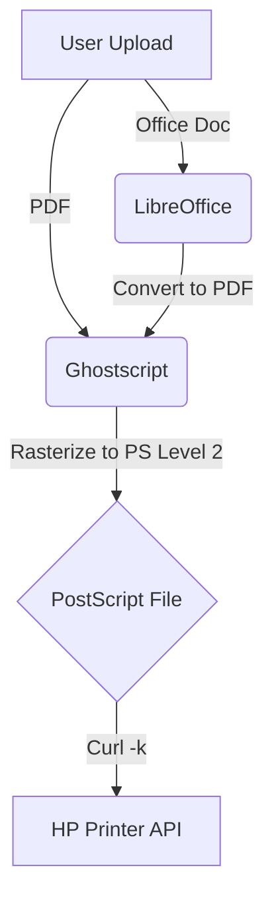

# HP P3015 Web Print Service 🖨️

A robust, driverless web print server written in Go. This tool provides a modern web interface that allows users to upload **Office documents and PDFs** directly to an **HP LaserJet P3015** (or similar legacy HP printers) without installing any drivers on the client device.

It is specifically engineered to solve common **"PDF Memory Overflow"** errors on older printers by preprocessing files on the server using **Ghostscript** and **LibreOffice**.

## ✨ Features

  * **🖥️ System Health Dashboard**: The web interface now includes a real-time **System Diagnosis** panel. It automatically checks if Ghostscript, LibreOffice, and Curl are installed and linked correctly.
  * **🔧 Custom Path Configuration**: You can now explicitly specify the paths for dependencies via command-line flags (perfect for Windows environments or non-standard Linux installs).
  * **📄 Comprehensive File Support**: Supports **Word (`.doc`, `.docx`), Excel (`.xls`, `.xlsx`), PowerPoint (`.ppt`, `.pptx`)**, PDF, PS, and TXT.
  * **🧠 Smart Conversion**: Office files are converted to PDF, then rasterized to **PostScript Level 2** to prevent printer crashes.
  * **🚀 Driverless & Cross-Platform**: Optimized for Linux, Windows, and macOS.

## 🛠️ Prerequisites

To ensure the conversion pipeline works, the host machine **must** have the following installed:

### 1\. Linux (Ubuntu/Debian) - *Recommended*

```bash
sudo apt update
# Install core dependencies
sudo apt install ghostscript curl libreoffice -y
# Install fonts (Prevents squares/garbled text in Word files)
sudo apt install fonts-wqy-zenhei fonts-wqy-microhei -y
```

### 2\. macOS

**Note:** The application automatically detects LibreOffice in `/Applications/LibreOffice.app`.

```bash
# Install dependencies via Homebrew
brew install curl ghostscript
brew install --cask libreoffice

# Install fonts
brew tap homebrew/cask-fonts
brew install --cask font-wqy-zenhei font-wqy-microhei
```

### 3\. Windows

1.  **Ghostscript**: Install [Ghostscript](https://www.ghostscript.com/releases/gsdnld.html).
2.  **LibreOffice**: Install [LibreOffice](https://www.libreoffice.org/).
3.  **Curl**: Built-in on Windows 10/11.
      * *Note: On Windows, you can pass the installation paths via flags if they are not in the System PATH.*

## 🚀 Quick Start

### 1\. Get the Application

```bash
# Build from source
go mod init print-server
go build -o printer-service main.go
```

### 2\. Run the Server

By default, the server listens on port `8080` and targets the printer at `10.31.6.225`.

```bash
./printer-service
```

When started, the console will display the detected environment:

```text
🚀 Print Server Started on :8080
🖨️  Target Printer IP: 10.31.6.225
----------------------------------------
🖥️  System: windows/amd64 (Server-PC)
📄 Ghostscript:  ✅ Found
📊 LibreOffice:  ✅ Found
🌐 Curl Utility: ✅ Found
```

### 3\. Configuration & Flags (New\!)

You can override defaults and specify paths explicitly. This is especially useful on Windows.

**Command Line Arguments:**

| Flag | Default (Auto-detected) | Description |
| :--- | :--- | :--- |
| `-port` | `8080` | Web server listening port |
| `-ip` | `10.31.6.225` | Target HP Printer IP address |
| `-gs` | `gs` (Linux/Mac) or `gswin64c` (Win) | Path to Ghostscript executable |
| `-office` | `libreoffice` (Linux) or `soffice` | Path to LibreOffice/OpenOffice executable |

**Examples:**

**Linux/Mac (Custom Port):**

```bash
./printer-service -port="9090" -ip="192.168.1.50"
```

**Windows (Specifying Paths):**
If dependencies are not in your System PATH, point to them directly:

```bash
printer-service.exe -office "C:\Program Files\LibreOffice\program\soffice.exe" -gs "C:\Program Files\gs\gs9.54\bin\gswin64c.exe"
```

## ⚙️ How It Works



1.  **Ingest**: User uploads a file.
2.  **Diagnosis**: The UI shows real-time status of server dependencies.
3.  **Conversion**:
      * **Office Files**: Invokes `libreoffice --headless` to convert to **PDF**.
      * **Optimization**: Invokes `gs` to convert PDF to **PostScript Level 2** (flattens transparency and fonts).
4.  **Transmission**: Uses `curl` to POST the final stream to the printer.

## ⚠️ Troubleshooting

**Q: The "System Diagnosis" panel shows "MISSING" for LibreOffice.**

  * **Fix**: Ensure LibreOffice is installed. If it is installed but not detected, find the path to `soffice` (or `soffice.exe`) and run the server with the `-office "/path/to/soffice"` flag.

**Q: Office files print with squares.**

  * **Fix**: The server is missing fonts. Install `fonts-wqy-zenhei` (Linux) or standard system fonts (Windows/Mac).

**Q: Paper Size Issues (Letter vs A4).**

  * **Fix**: Edit `main.go`. Look for `-sPAPERSIZE=letter` in the `execGS` function and change it to `a4`.

## 📄 License

GPLv3.